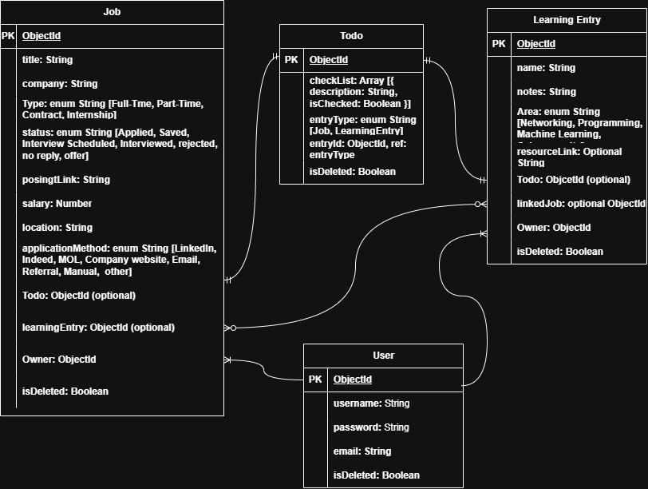

# Waypoint Tracker

## Overview
**Waypoint** is a full-stack MEN (MongoDB, Express, Node) application that helps job seekers track their job search and the learning behind it, in one connected place.

Users can log their job applications through each stage (applied, awaiting response, interview, offer) alongside learning entries tied to specific topics and confidence levels, linking what they're studying to the roles they're chasing. To-dos attach to either a job or a learning entry for prep tasks and follow-ups, and a dashboard surfaces overall progress at a glance.

Built as a General Assembly Unit 2 project to demonstrate full-stack CRUD, RESTful routing, and authentication, and to double as a real record of the project developer's own job search and self-directed growth.

## Screenshots

## Technologies Used
- JavaScript
- Node.js 
- Express
- MongoDB
- EJS
- CSS

## Getting Started

## User Stories

1. As a User, I want to be able to add an entry to track a certain job application.
2. As a User, I want to be able to add an entry for learning a new concept or skill.
3. As a User, I want to be able to create a todo list for each entry..
4. As a User, I want to be able to edit both the job and learning entry.
5. As a User, I want to link certain learning entries to certain job applications.
6. As a User, I want to be able to delete the entries.
7. As a User, I want to see what entries are linked to each other.
8. As a User, I want a good looking navbar in order to navigate easily between pages.
9. As a User, I want to be able to view my profile. 
10. As a User, I want to edit my profile. 
11. As a User, I want to see all my todos, including the finished and pending ones. 
12. As a User, I want to have a dashboard to see a summary of my progress. 
13. As a User, I want to change my password.

## Post MVP User Stories

1. As a User, I want to Login by email.
2. As a User, I want to to have a 2FA option.
3. As a User, I want to get authenticated via email in order to change the password. 
4. As a User, I want to export all the job application entries in an excel sheet file. 
5. As a User, I want to see graphs that visualize and summarize certain information like what field the user did mostly applied to.

## Database Design 

## Routes

### Dashboard

| Method | Route  |       Description       |
|:------:|:-----: |:-----------------------:|
| GET    |  ` / ` | View Dashboard/Homepage |

### Job Entries 

| Method |      Route     |             Description             |
|:------:|:--------------:|:-----------------------------------:|
|   GET  | `/jobs  `        | View Job Entires Page               |
|   GET  | `/jobs/new `     | View Create Job Entry Page          |
|  POST  | `/jobs  `        | Submit form to save Job Entry       |
|   GET  | `/jobs/:id/`     | View Job Entry Details              |
|   GET  | `/jobs/:id/edit` | View Edit Job Entries Page          |
|   PUT  | `/jobs/:id`      | Submit form to Update Job Entry     |
| DELETE | `/jobs/:id `     | Submit form to make isDeleted: true |

### Learning Entires

| Method |        Route        |              Description             |
|:------:|:-------------------:|:------------------------------------:|
|   GET  | `/learnings`          | View Learning Entries Page           |
|   GET  | `/learnings/new`      | View Create Learning Entry Page      |
|  POST  | `/learnings`          | Submit form to save Learning Entry   |
|   GET  | `/learnings/:id/`     | View Job Learning Entry Details      |
|   GET  | `/learnings/:id/edit` | View Edit Learning Entry Page        |
|   PUT  | `/learnings/:id`      | Submit form to Update Learning Entry |
| DELETE | `/learnings/:id`      | Submit form to make isDeleted: true  |

### Todos 

| Method |      Route      |               Description              |
|:------:|:---------------:|:--------------------------------------:|
|   GET  | /todos          | View todo lists Page                   |
|   GET  | /todos/new      | View Create todo list Page             |
|  POST  | /todos          | Submit form to save the todo in the DB |
|   GET  | /todos/:id/edit | View and edit the todo list            |
|   PUT  | /todos/:id      | Submit form to Update a specific todo  |
| DELETE | /todos/:id      | Submit form to soft delete the todo    |