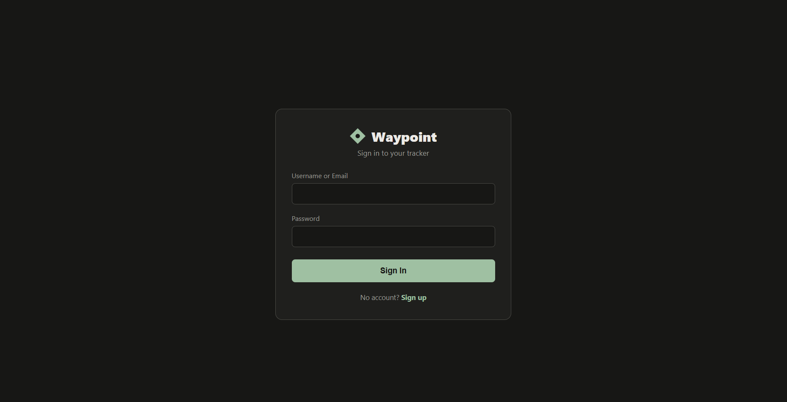
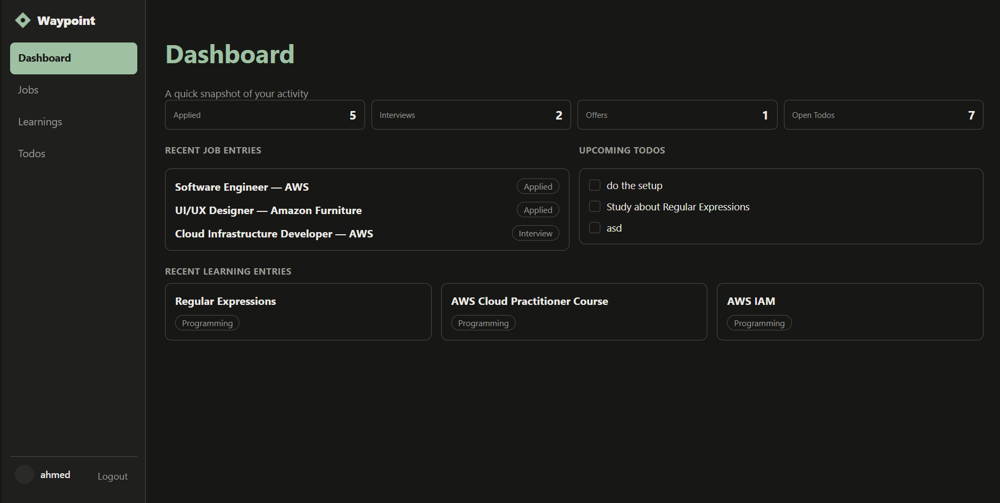
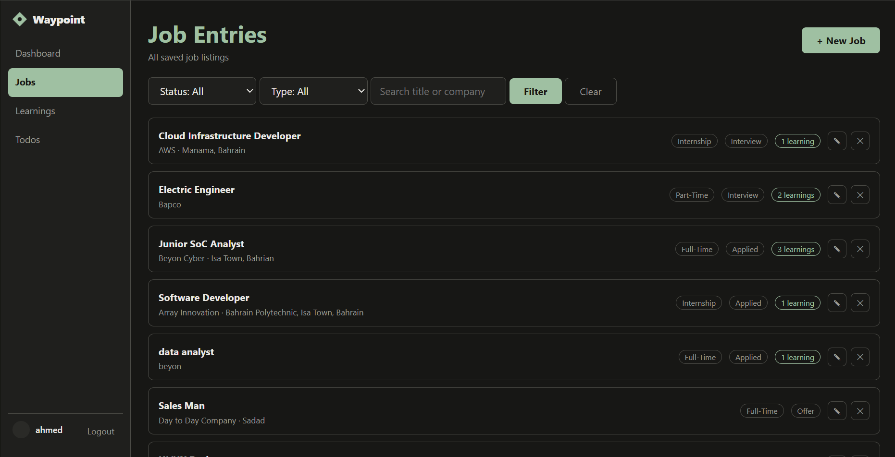
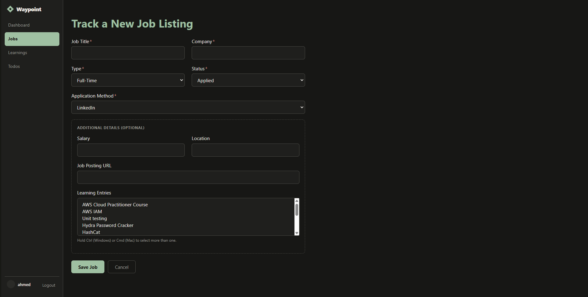
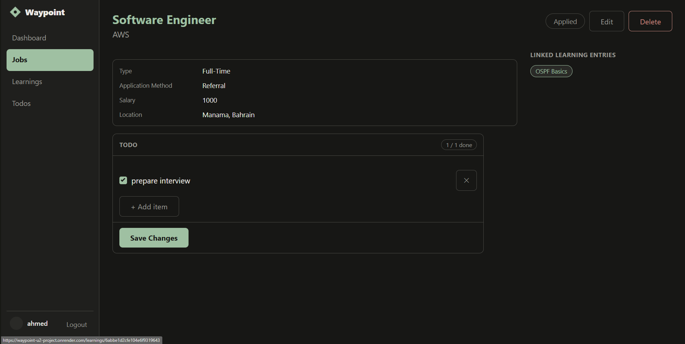
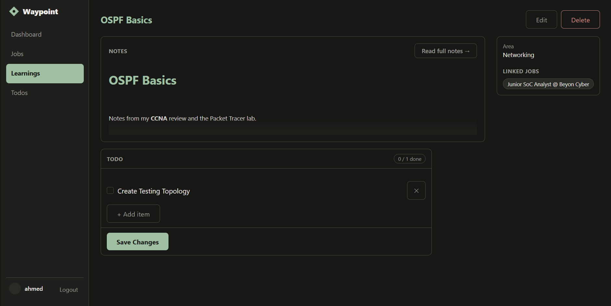
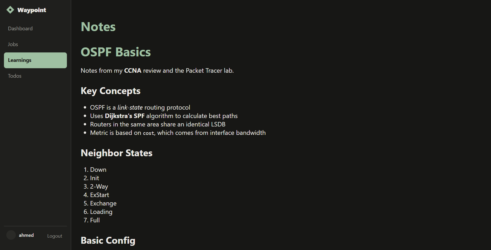
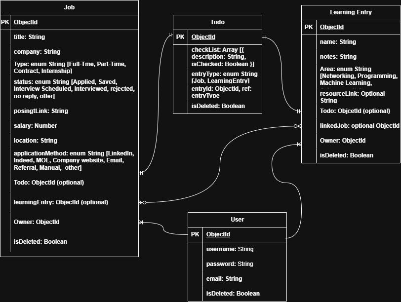

# Waypoint Tracker

## Overview
**Waypoint** is a full-stack MEN (MongoDB, Express, Node) application that helps job seekers track their job search and the learning behind it, in one connected place.

Users can log their job applications through each stage (applied, awaiting response, interview, offer) alongside learning entries tied to specific topics and confidence levels, linking what they're studying to the roles they're chasing. To-dos attach to either a job or a learning entry for prep tasks and follow-ups, and a dashboard surfaces overall progress at a glance.

Built as a General Assembly Unit 2 project to demonstrate full-stack CRUD, RESTful routing, and authentication, and to double as a real record of the project developer's own job search and self-directed growth.

## Screenshots

### Sign In Page


### Dashboard - Home Page


### Job List Page


### Create New Job Page


### Job Details Page


### Learning Details Page


### Learning Notes Page


### Todo Lists Page


## Technologies Used

- **Node.js** and **Express:** server and routing
- **MongoDB** and **Mongoose:** database and data models
- **EJS:** server-side page templates
- **HTML** and **CSS:** front end, with plain CSS split into separate stylesheets

### Packages

- **bcrypt:** password hashing
- **connect-mongo:** stores sessions in MongoDB
- **dotenv:** loads environment variables from `.env`
- **express-session:** session-based login
- **markdown-it:** renders Markdown text as HTML
- **method-override:** lets HTML forms send PUT and DELETE requests
- **morgan:** request logging during development

### Dev Packages

- **Jest:** testing framework
- **mongodb-memory-server:** in-memory MongoDB for running tests
## Getting Started

Follow these steps to clone and run the project locally on your machine.

### 1. Clone the Repository

```bash
git clone https://github.com/A-Alsaffaf/Waypoint-U2-Project.git
cd Waypoint-U2-Project
```

### 2. Install Dependencies

Install all required Node packages:

```bash
npm i
```

### 3. Configure Environment Variables

Create a `.env` file in the root directory:

```bash
touch .env
```

Add your configuration settings inside `.env`:

```env
MONGODB_URI=mongodb://127.0.0.1:27017/waypoint
SESSION_SECRET=your_secret_here
PORT=3000
```

### 4. Start MongoDB

Ensure your local MongoDB instance or database service is active and running.

### 5. Run the Application

Start the development server:

```bash
nodemon server.js
```

### 6. View in Browser

Open your browser and navigate to:

```
http://localhost:3000
```

## User Stories

1. As a User, I want to be able to add an entry to track a certain job application.
2. As a User, I want to be able to add an entry for learning a new concept or skill.
3. As a User, I want to be able to create a todo list for each entry..
4. As a User, I want to be able to edit both the job and learning entry.
5. As a User, I want to link certain learning entries to certain job applications.
6. As a User, I want to be able to delete the entries.
7. As a User, I want to see what entries are linked to each other.
8. As a User, I want a good looking navbar in order to navigate easily between pages.
9. As a User, I want to be able to view my profile. 
10. As a User, I want to edit my profile. 
11. As a User, I want to see all my todos, including the finished and pending ones. 
12. As a User, I want to have a dashboard to see a summary of my progress. 
13. As a User, I want to change my password.

## Post MVP User Stories

1. As a User, I want to Login by email.
2. As a User, I want to to have a 2FA option.
3. As a User, I want to get authenticated via email in order to change the password. 
4. As a User, I want to export all the job application entries in an excel sheet file. 
5. As a User, I want to see graphs that visualize and summarize certain information like what field the user did mostly applied to.

## Database Design 



## Routes

### Dashboard

| Method | Route  |       Description       |
|:------:|:-----: |:-----------------------:|
| GET    |  ` / ` | View Dashboard/Homepage |

### Job Entries 

| Method |      Route     |             Description             |
|:------:|:--------------:|:-----------------------------------:|
|   GET  | `/jobs  `        | View Job Entires Page               |
|   GET  | `/jobs/new `     | View Create Job Entry Page          |
|  POST  | `/jobs  `        | Submit form to save Job Entry       |
|   GET  | `/jobs/:id/`     | View Job Entry Details              |
|   GET  | `/jobs/:id/edit` | View Edit Job Entries Page          |
|   PUT  | `/jobs/:id`      | Submit form to Update Job Entry     |
| DELETE | `/jobs/:id `     | Submit form to make isDeleted: true |

### Learning Entires

| Method |        Route        |              Description             |
|:------:|:-------------------:|:------------------------------------:|
|   GET  | `/learnings`          | View Learning Entries Page           |
|   GET  | `/learnings/new`      | View Create Learning Entry Page      |
|  POST  | `/learnings`          | Submit form to save Learning Entry   |
|   GET  | `/learnings/:id`      | View Learning Entry Details      |
|   GET  | `/learnings/:id/notes`| View Notes Page      |
|   GET  | `/learnings/:id/edit` | View Edit Learning Entry Page        |
|   PUT  | `/learnings/:id`      | Submit form to Update Learning Entry |
| DELETE | `/learnings/:id`      | Submit form to make isDeleted: true  |

### Todos 

| Method |      Route      |               Description              |
|:------:|:---------------:|:--------------------------------------:|
|   GET  | `/todos`        | View todo lists Page                   |
|   GET  | `/todos/new`    | View Create todo list Page             |
|  POST  | `/todos`        | Submit form to save the todo in the DB |
|   GET  | `/todos/:id`    | View and edit the todo list            |
|   PUT  | `/todos/:id`    | Submit form to Update a specific todo  |
| DELETE | `/todos/:id`    | Submit form to soft delete the todo    |

## Features

- **Authentication:** sign up, sign in and sign out, with each user seeing only their own data
- **Dashboard:** a snapshot of applied, interview, offer and open todo counts, plus recent jobs, learnings and upcoming todos
- **Job tracking:** add, view, edit and delete job applications with status, type, application method, salary, location and posting link
- **Learning entries:** keep notes on topics by area, with an optional resource link
- **Job and learning links:** connect learning entries to the jobs they relate to, and see the links from both sides
- **Todo checklists:** add checklist items to any job or learning entry and tick them off as you go
- **Filtering:** narrow the job and learning lists by status, type or area
- **Soft delete:** deleted entries are hidden from the lists instead of being removed from the database

## Extra Features
- **Fitering:** Jobs and learning entries including a search bar and a select based on the status and type for jobs along with the learning area.

- **Relation Ship Testing:** Using a package called jest, we can use a script to include few tests in order to test our models relationships.

- **Markdown formatted notes:** learning notes can be saved and rendered as MD format in the details page along with it's dedicated page.

- **Amazing Design:** Great design that matches the theme and feel of the project idea. **(Based on Jameela Statment)**

## Future Enchantments
- **CV Upload:** add this feature to have a refrence to multiple version of the resume and link it with the job applications you applied for with that specifc CV.
- **Email Confirmation:** add 2FA verification via the email for more security and protection. 
- **Public Learning Entries:** a public page that display the learning entries you want to share with other, other users will be able to leave comments and review the learning entries and their notes. 
- **Profile Modifcation:** let the user to modify their profile from adding an image to add a title and changing their username along with first, last names.
- **Admin Role:** to supervise and monitor the public entries, manage the users.

## Credits

Shoutout to my teacher (**Omar Kamal**) for helping me to implement the filter feature along with other general stuff in the website